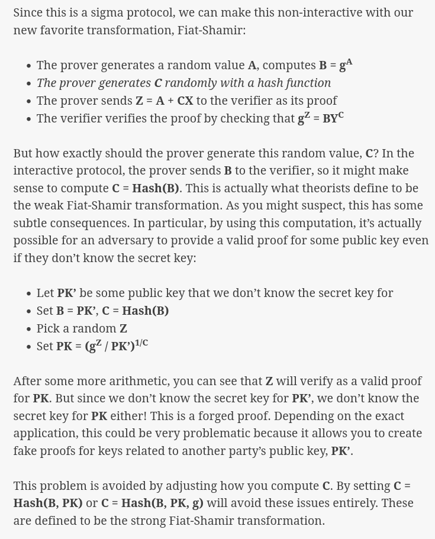
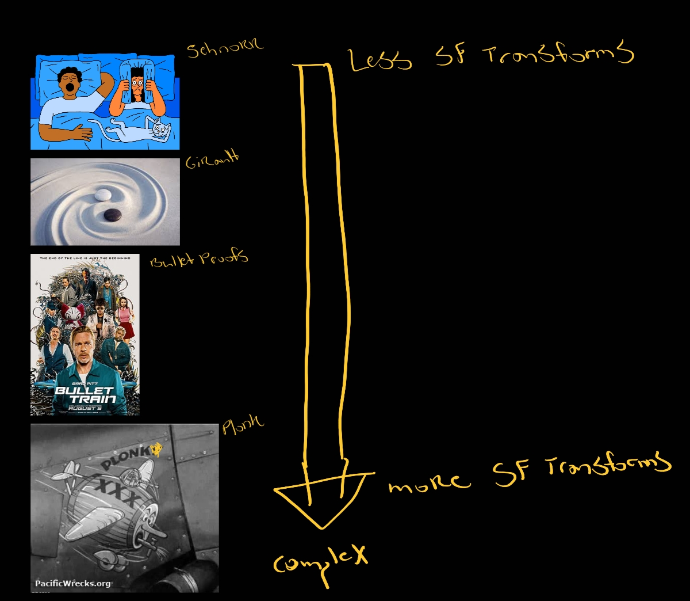
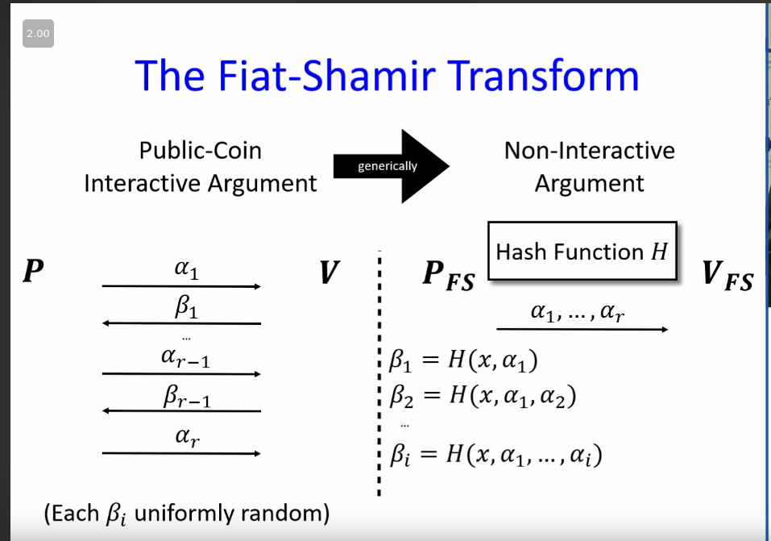
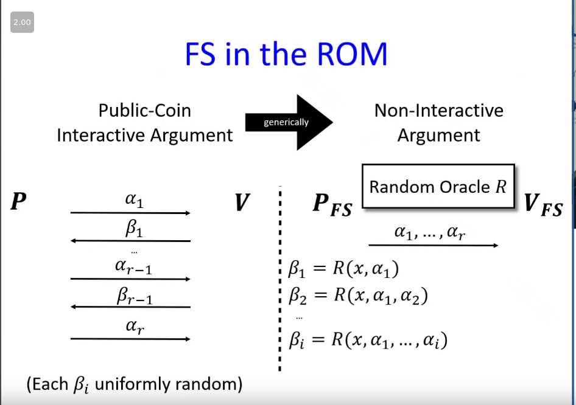
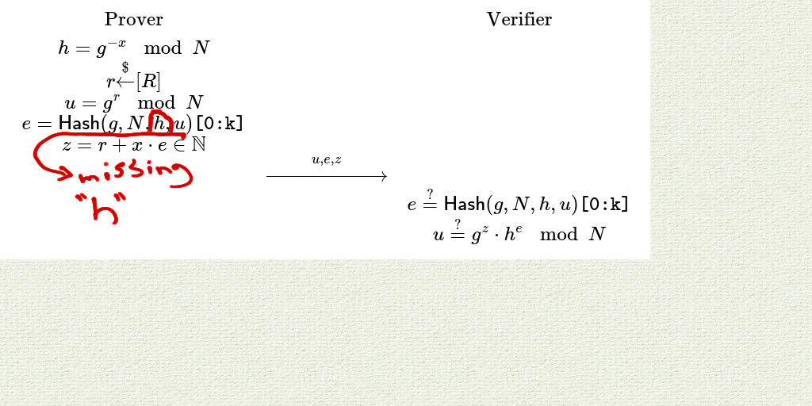
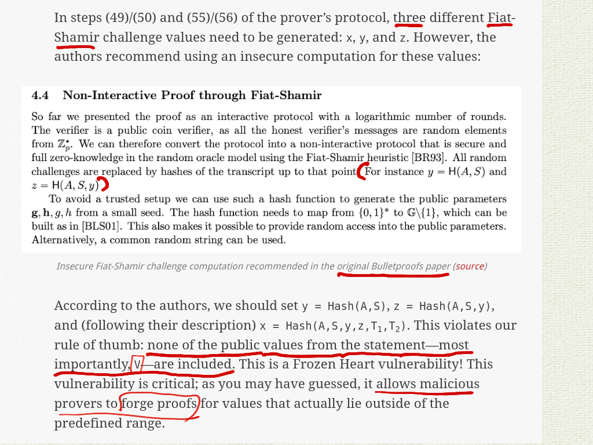
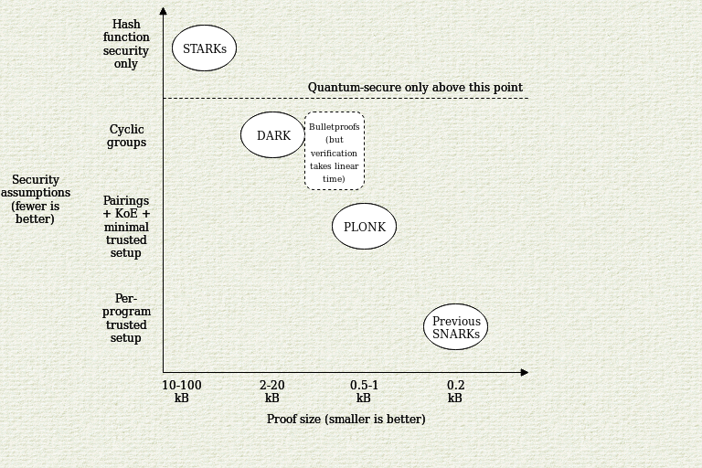
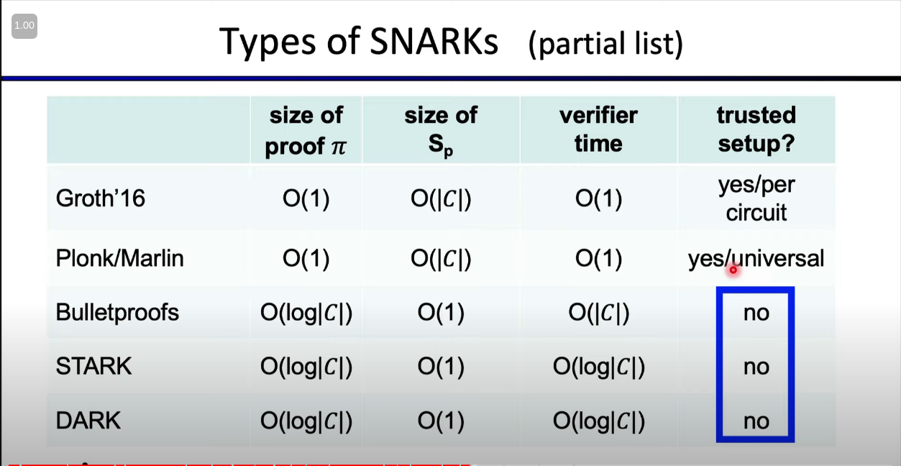
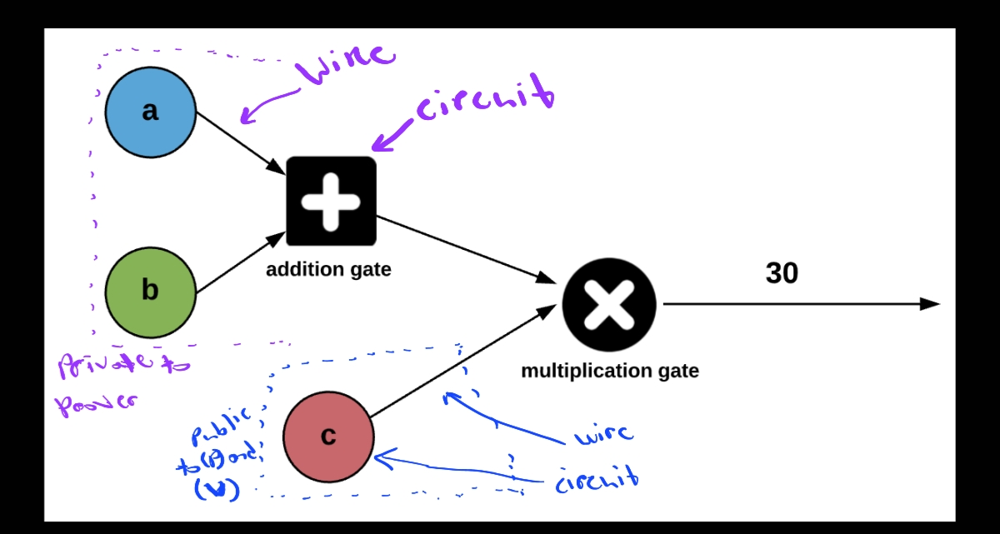
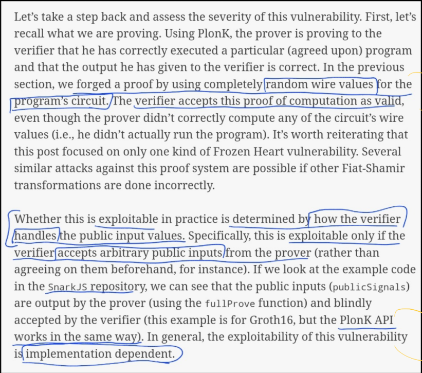

[Podcast](https://trailofbits.audio/episodes/zkdocs) on the backstory of this vulnerability 

## Outline
- TL;DR
	- Frozen Heart Vuln - What, How, and Why
- Prerequisites to intuit the vulnerability
- Walk-through each protocol impacted
	- ELI5 exploit for each protocol

---

## TL;DR
If you don't want to read the detailed posts, I recommend reading [the intro post](https://blog.trailofbits.com/2022/04/13/part-1-coordinated-disclosure-of-vulnerabilities-affecting-girault-bulletproofs-and-plonk/), which provides an intuitive understand for the issue. 

Frozen Heart
- **Frozen**  is an acronym - "FoRging Of ZEro kNowledge" proofs
- **Heart** - Fiat-Shamir transformation is at the _heart_ of most proof systems: it’s vital for their practical use, and it’s generally located centrally in protocols.

Frozen Heart exploits one main issue. That's the incorrect implementation of Fiat-Shamir. Trail of Bits quote sums it up well. 

> the Fiat-Shamir hash computation must include all **public values** from the zero-knowledge proof statement and all public values computed in the proof (i.e., all random “commitment” values).

Each protocol has there own specific issues, but they're all stemming from the same central weakness... incorrect implementation of Fiat-Shamir. 

The short-term fix - Include all **public** **values** from the proof statement AND all public values computed in proof

The "why" behind this issues comes down to a simple formula - vague descriptions + lack of guidance = vulnerabilities. See snippet from Trail of Bits blog. 

> It really comes down to a combination of ambiguous descriptions in academic papers and a general lack of guidance around these protocols.

--- 
## Prerequisites

It's important to understand Fiat-Shamir's (FS) function to better grasp the vulnerability. 

So here are some prerequisites... 

#### Three Ingredients of ZK 

This vuln is focused on the "soundness" of the protocols.

- Completeness — if the statement is true then a prover can convince a verifier  
- **Soundness** — a cheating prover can not convince a verifier of a false statement  
	- Vulnerable to Frozen Heart
- Zero-knowledge — the interaction only reveals if a statement is true and nothing else

#### **Fiat-Shamir**

Trail of Bits [ZK intro article](https://blog.trailofbits.com/2021/02/19/serving-up-zero-knowledge-proofs/) is a good place to start for an Intro to Fiat-Shamir.
- [Example](https://blog.trailofbits.com/2021/02/19/serving-up-zero-knowledge-proofs/) from ToB, showing our verifier turning into a Random Oracle (ROM - A wall in this case), so we're able to turn interactive > non-interactive proof. 

> (1) The prover hits the ball to the verifier
> 
> (2) the verifier sends a random return back to the prover—random speed, location, amount of spin, etc.
> 
> (3) the prover must return the ball to a targeted spot on the court. If the prover hits the target, the verifier classifies them as a good tennis player. If they do not hit the mark, they are classified as a bad tennis player.

**The main issue** 

Highlighting main points... 

More complex ZK system, higher chance of severe impact from the frozen heart vuln

(Video) [Ron Rothblum](https://youtu.be/9cagVtYstyY?t=80) - The Fiat-Shamir Transform
- Ron does a good job explaining non-interactive proofs in an approachable way. I recommend watching from 1:20 - 11:00 to get an intuitive understanding, but the rest is still useful, just a bit more complex. 

Non-interactive hash function

Replacing Hash with Random Oracle 

---
--- 

## Three protocols impacted
---
---
#### Girault's Proof ([link](https://blog.trailofbits.com/2022/04/14/the-frozen-heart-vulnerability-in-giraults-proof-of-knowledge/))

Example

> Let’s look at an example. In [ZenGo’s implementation](https://github.com/ZenGo-X/zk-paillier/blob/00dfebc2a92977d4fcab44f773f2ed20e03d275f/src/zkproofs/wi_dlog_proof.rs#L74-L78) ( <-- Open and show code) of Girault’s proof of knowledge (before it was patched), `e` is computed by hashing `g`, `N`, and `u`, but not `h` (in this implementation, `h` is represented by `statement.ni`).

> Therefore, failure to include `h` in this computation introduces a Frozen Heart vulnerability, allowing malicious provers to forge proofs for random `h` values, even if they do not know its discrete log.

Stand alone - No biggy! 

> The impact depends entirely on how the proof system is used. If it's simply for standalone public keys (i.e., keys that are not used as part of some larger protocol), then this vuln may not be that severe.

BUT!

Part of a larger system - Possibly severe 

> However, if this proof system is used within a larger, more complex protocol—such as a threshold signature scheme, which requires that the proof be unforgeable—then a Frozen Heart vulnerability is likely very severe.

---
#### Bullet Proof ([link](https://blog.trailofbits.com/2022/04/15/the-frozen-heart-vulnerability-in-bulletproofs/?utm_source=pocket_reader))

Bullet proofs are a type of "range proof". A prover proves that a certain secret value lies within a predefined range without having to reveal the value itself. 

> Bulletproofs operate over a cryptographic primitive known as a Pedersen commitment (example below), a specific type of [commitment scheme](https://en.wikipedia.org/wiki/Commitment_scheme). Using a commitment scheme, a party can create a commitment, which binds the party to a secret value but does not reveal any information about this value. Later, this party can decommit or reveal this commitment; if revealed, and if the scheme is secure, the other party can be sure that the revealed value is the same as the original committed value.

[Image source](https://medium.com/coinmonks/zero-knowledge-proofs-um-what-a092f0ee9f28)

Error: this vulnerability is the result of an error made by the authors of the original Bulletproofs paper, in which they recommend using an insecure Fiat-Shamir implementation.

- Resource
	- (Video) Efficient Confidential Transactions Using [Bulletproofs](https://youtu.be/ilGfKH-kFiQ)-Dan Boneh, Stanford University | NEO DevCon 1 

---
#### PlonK ([link](https://blog.trailofbits.com/2022/04/18/the-frozen-heart-vulnerability-in-plonk/?utm_source=pocket_reader))

Plonk is a type of zkSNARK

**[Vitaliks Plonk Blog](https://vitalik.ca/general/2019/09/22/plonk.html)**

> The second improvement is that the "fancy cryptography" it relies on is one single standardized component, called a "polynomial commitment". PLONK uses "Kate commitments", based on a trusted setup and elliptic curve pairings, but you can instead swap it out with other schemes, such as [FRI](https://vitalik.ca/general/2017/11/22/starks_part_2.html) (which would [turn PLONK into a kind of STARK](https://eprint.iacr.org/2019/1020)) or DARK (based on hidden-order groups). This means the scheme is theoretically compatible with any (achievable) trade-off between proof size and security assumptions.
- Possibly capable of adapting proof scheme to the problem. In the long-term we'd ideally discover a silver bullet with no trade-offs (wishful thinking?) 

> What this means is that use cases that require different trade-offs between proof size and security assumptions (or developers that have different ideological positions about this question) can still share the bulk of the same tooling for "arithmetization" - the process for converting a program into a set of polynomial equations that the polynomial commitments are then used to check. If this kind of scheme becomes widely adopted, we can thus expect rapid progress in improving shared arithmetization techniques.
- Note: Shared tooling will help with adoption, composition, etc. 

[Useful table from Dan](https://youtu.be/H3GmsxRU1Kw?t=2700)

Plonk like other zkSNARKs use wires and circuits, these can be private or public to both the prover and/or verifier.  

[Image source](https://medium.com/web3studio/simple-explanations-of-arithmetic-circuits-and-zero-knowledge-proofs-806e59a79785) (with my annotations)

In this case the Frozen Heart vulnerability affects the Dusk Network, Iden3, and ConsenSys stemimg from their failure to include the public inputs in these computations. 
	*- Note: This explanation is focusing on [this version posted in March 2020](https://eprint.iacr.org/eprint-bin/getfile.pl?entry=2019/953&version=20200308:114744&file=953.pdf), as this (or a similar version) appears to be what the `SnarkJS` implementation is based on.*

Random wire values input by the prover and blindly accepted by the verifier

Resources
- (Video) [David Wong's](https://youtube.com/playlist?list=PLBJMt6zV1c7Gh9Utg-Vng2V6EYVidTFCC) PLONK YouTube Playlist
- (Blog) [Vatalik's post](https://vitalik.ca/general/2019/09/22/plonk.html) on understanding PLONKs
	- *Note: recommend only reading the introduction to intuit the process, but anything past "How PLONK works" will get math heavy quick.* 
